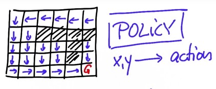
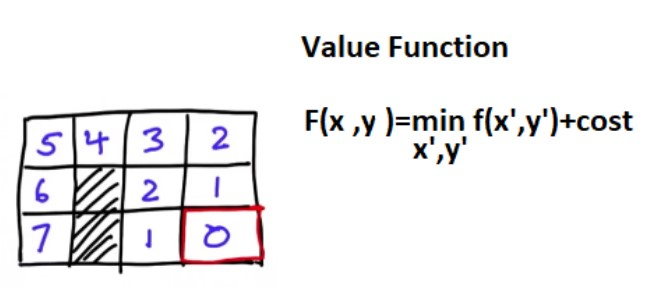
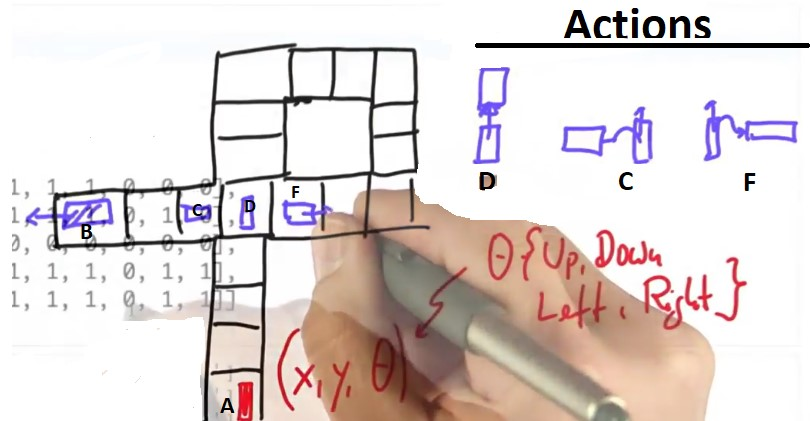

# Search-Algorithms (A-Star and Dynamic-Prgramming)

## 1. Introduction
 In this repository we will learn some of the foundational search algorithms (A* and dynamic Prgramming) used in discrete path planning. Path planning can be explained in the self-driving car as how the vehicle generates safe drivable trajectories to get where we want it to go. 

The path planning block uses all of  data (data from computer vision and sensor fusion in order to understand the environment around us and data from localization to understand precisely where we are in that environment) to decide which maneuver to take next then it constructs a trajectory for the controller to execute. 

This lesson covers discrete path planning and even though the real world is continuous, there are many situations where discretizing the world makes it easier and computationally faster to solve path planning problems.

In addition to the practical benefits of these algorithms, it's also conceptually useful to learn about them because they deal with some of the same concepts that we will keep coming back to in this lesson. Those concepts include:

* Cost functions and how to include human insights (like "it's easier to make right turns than left turns") into our planning algorithms.
* Optimality and the tradeoffs associated with finding the best solution vs finding a solution that is good enough.
* Online vs Offline algorithms and how we can avoid complex computation on the road by precomputing best paths whenever possible.

The fundamental problem in motion planning is that a robot might live in a world like below and it might want to find its way to a goal and has to device a plan to get to the goal. This same problem occurs for a self driving car that might live in a city near a highway on a network of streets. It has to find its way around and navigate to its target location which need to pan a path.

If we look at the intersection in figure below, a car coming from A (Start) that wishes to go to B (goal). To take a left turn (C) on the intersection, this car would have to turn right first (D), engage in a lane shift (F) and then take the left turn(C) to the goal location (B).

  
 

Now, a lane shift (F) is a risky proposition. If there is a  truck parked, the space might be insufficient to carry out the lane shift. An alternative plan might be to go straight (G), take the detour around the block, and then go straight to the target location.

**The process of finding a path from a start location to a goal location is called "planning." For robots, it's often called "robot motion planning.** We are going to talk about discrete methods for planning in which the world chopped into small bins.

What's the planning problem? 

* We're given a map of the world.
* We're given a starting location.
* We're given a goal location.
* we're given some sort of a cost function. The simplest way to think of cost is just the time it takes to drive a certain route.

**The goal is find the minimum cost path.**

Let's look at the path planning problem as a search problem. Let's start with a little grid world of size 6 x 5  where our start location is in the top left corner, our goal in the bottom right corner. I block off a few cells so there is still a safe path to the goal. This could be a search through a city graph, through a parking lot or through a maze of streets for a mobile robot.
Just for simplicity, in this example let's assume the robot is given 4 actions.It can go up, down, left, or right. Also for simplicity, let's assume every action succeeds with absolute certainty. We don't model uncertainty in this example.

  
 

As seen, 11 action are required to go from the start to the goal.

## 2. First Search Program

The big question now is, can we write a program that finds the shortest path from Start to Goal to do this, Let's give the grid cells names. We have six columns named from zero to five and five rows from zero to four and the basic idea I would pursue is that I keep a list of nodes that I wish to investigate further as we search and expand. 

Let's call this list “open”, to the beginning of any one state on this list is [0,0] the initial state.  just to make sure we never pick the state again we checkmark the state with a  red check. I now can test whether this state [0,0]  is my final goal state. Obviously it's not. I'm not done with planning yet.
Next I expand this state so take it [0,0] off my open list and look at all the successors of which there are two [1,0] and [0, 1]. Those two are now expanded (We checked them) and one last thing I maintain for each of these states on the open list is, the number of expansions it took to get there (zero for initial state and one for these two states). The number of expansions is called g value and when you are done with the planning, will be the length of the optimal path. 

  
 

Let's go further and expand one of the two ([1, 0] and [0, 1]). We always expand the one **with the smallest g value** but these are equivalent (they both have a g value of one). Let me expand the first one. The first one has 3 neighbours ([0,0],[1,1],[2,0])and because [0 ,0] is already closed with a checkmark we don't consider it anymore, which gives me [2, 0] and [1, 1] both with the g value of 2 and we checkmark those ([1,1],[2,0]) . Now I pick again the node on the open list with the smallest g value which happens to be the [0,1].  There's really no choice. It has 2 neighbours ([0 0] and [1 1]) by both already checked. So therefore there is no expansion that takes place. 

  
 

I only expand if I find an unchecked node. The new open list has these two nodes ([2,0]and [1,1]) and  the algorithm is executed further and what's going to happen is my nodes will expand gradually into the free space until I eventually hit the goal node and without proof the g value, when I hit the goal node will be exactly the number of steps it takes to go from the Start state to the Goal node. The secret for that lies in the fact that I always expand the node with the smallest g value. 

**You can finde a piece (First Search Program Section) of code [Here](https://github.com/A2Amir/Search-Algorithms-A-Star-and-Dynamic-Prgramming/blob/master/Code.ipynb) that implements what I just described.This is the key of a search algorithm.**

###  2.1 Expansion Grid

In this [Expansion Grid section](https://github.com/A2Amir/Search-Algorithms-A-Star-and-Dynamic-Prgramming/blob/master/Code.ipynb), I print out a table like below called expand. What expand is, is a table of the same size as grid that maintains at what step each node was expanded.
Every node that has never been expanded including all the obstacle nodes should have the value of -1 and when a node is expanded, it should get a unique number that is incremented from expansion to expansion and counts from 0, in this case, all the way to 22 for reaching the goal stated.

  
 

###  2.2 Print Path

To see an output like below, there are arrows to the right and down, which is the optimal action to take in the cells  and in the end a star, which indicates the location of the goal is  implemented in [the print path's section](https://github.com/A2Amir/Search-Algorithms-A-Star-and-Dynamic-Prgramming/blob/master/Code.ipynb) an algorithm with all steps.

  
 

## 3. A*

Now I want to come with you to the absolute meat of this lesson, which is called A*, A* was invented by Nels Nelson at Stanford many years ago and is a variant of the search algorithm that is more efficient than expanding every node.
I you understand mechanism for searching by gradually expanding nodes in the open list, A* is almost the same thing but not quit. To illustrate A * I am going to use the same grid as before but with different obstacle configuration, as you see below, we are forced to go from Start to Goal.

  
 

A* uses a called heuristic function, which is a function that has to be set up and If we call the heuristic function (h) then for each cell it results into  a value (the number of steps it takes to the goal if there was no obstacle).
So the heuristic function has to be an optimistic guess how far we are from the goal, put differently for any cell (x,y) heuristic function has to be an optimistic guess, which means a smaller or equal value to the actual goal distance from the coordinate x and y.
The beauty of the heuristic function lies in, it does not have to be accurate, if it was accurate you probably solved the planning problem. It boils down much to the number of which cell steps but for the Euclidean distance to the target location.

To implement A* algorithm, the key modification for our search algorithm is really simple, we again have an open list  and we add our state and write g-value, we also write g value plus the heuristic value (f value), if we now expand we remove the element **with the lowest f value** (not the lowest g value). That is all for implementing a A*

  
 

You can find all of the implemented steps of the A* algorithm [Here](https://github.com/A2Amir/Search-Algorithms-A-Star-and-Dynamic-Prgramming/blob/master/Code.ipynb).

## 4. Dynamic Programming

I now want to teach an alternative method for planning. This alternative method has a number of advantages and a number of disadvantages. It's called dynamic programming and just like A-star, it's going to find the shortest path.
You give the alternative method:
* A map of the environment as in A-star, 
* One or more goal positions
the output.
* the best path from any possible starting location.

  
 

If you reach the straight lane (G), the only way to get to the goal is to go around the block. You've seen this example before.
Now, the point I want to make is a different one. That is, your attempt to do a lane shift (F) might fail. Why would it fail?  it could be there's a big, truck in this lane (F) and as you go into the right lane when you're waiting for the truck to disappear, there are people behind you that honk their horns.

You really don't want to wait for the truck to disappear. That means the environment is stochastic and the outcomes of actions are non-deterministic.  In our planning we ignored this, but in reality that's the case.

**What that means is you need a plan not just for the most likely position but you might need a plan for other positions as well.**

What dynamic programming gives you is a plan for every position. If we redraw this environment as a grid with a goal location and certain obstacles, they dynamic programming gives you an optimal action to do at every single grid cell.As you can see below, each grid cell now has a label. That label is often called policy.

  
 

Policy is a function that maps the grid cell into an action in this case as a move left, move down, move right, or move up. Now, we will compute a policy using dynamic programming.

Let me make a simple example of a world like below  with the obstacles,  Say the goal state is the one in the corner, Rather than telling you how to compute the optimal policy, which assigns an action to each of these cells, let me say about "value."

  
 

 A "value function" associates to each grid cell the length of the shortest path to the goal (For the goal, obviously, it is 0 and for each adjacent cell to the goal, it's obviously 1 and so on). This is recursively calculated by taking the optimal neighbour x-prime, y-prime, considering its value, and by adding the costs it takes to get there (in our example cost will be 1). By applying this update equation recursively, we can attain this value function. 
 
Once we have this value function (gird above ), we find that the optimal control action is obtained by minimizing the value, which is a hill-climbing type of action.

## 5. Left Turn Policy

In real traffic, often you have to wait for oncoming traffic. Let me say in our planning, left turns are more expensive. In fact, I should mention that parcel delivery services that plan for optimal routes of trucks like FedEx and UPS in the States, they actually plan routes that try to avoid left turns during rush hours, because it just takes much longer to do left turns.
For this reason, we would like to punish left turns, to perform this policy we need change cost for each action we have. Suppose we have a car like figure below. This car now has its state a x, a y, and an orientation (theta).By orientation for simplicity is chosen from 4 possible directions (up, down, left, and right).  I'd like to get to the location B (facing left). Realize that now the state space is 3-dimensional,I now would like to implement a dynamic programming planner that gives me the optimal path for going from A to B by considering the cost policy for each action.

  
 
There are three principle actions:

* One is move in which the car just goes 1 grid cell forward in its present orientation. It doesn't turn at all. That could be applied anywhere in the maze in any direction.
* One is turn left and then move.
* The last one is turn right and move.

These actions come with different costs:

* The right turn costs me 2
* Going straight costs me 1 
* Going left costs me 1

If I were to increase the cost for the left action to 20, then my path to get the location changes.You can find all of the implemented steps of theLeft Turn Policy [Here](https://github.com/A2Amir/Search-Algorithms-A-Star-and-Dynamic-Prgramming/blob/master/Code.ipynb).

